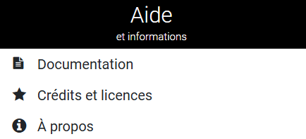

# Application cartographique vMap2

Initiation à l’utilisation de l'application cartographique vMap 2- Documentation de prise en main

## Comment accéder à vMap2?

### Compte utilisateur :

Actuellement l'accès à l'application vMap2 nécessite obligatoirement un compte (il n'y a pas d'accès "public")

**Procédure de création de compte :**
Pour toute demande de compte, merci de bien vouloir envoyer un mail à l'adresse mail suivante : [sig@lunelagglo.fr](mailto:sig@lunelagglo.fr)

1.	 Un formulaire de création de compte vous sera envoyé
2.	 Remplir et retourner par mail ce formulaire dûment complété.

⚠️ **L'Accès aux informations cadastrales devra être justifié**

### Connexion à vMap2 :
Pour accéder à la plateforme, merci de taper ou copier/coller l’adresse suivante dans votre navigateur:
[https://carto.lunelagglo.fr/](https://carto.lunelagglo.fr/)

⚠️ **Veillez à bien respecter les majuscules et minuscule de votre identifiant et mot de passe**

### Chargement de vMap2 :

A l'ouverture de vMap2, la carte chargée par défaut est du cadastre.

 

## Interface de vMap2 :

**1.	Accès à l'ensemble des cartes :**

Les utilisateurs peuvent visualiser toutes leurs cartes disponibles ainsi que leur arborescence et leur légende. Ces éléments permettent de naviguer et d'explorer les différentes données géospatiales efficacement.

**2.	Espace utilisateur, options d'affichage et traitement des cartes :**

L'espace dédié au compte utilisateur offre des options personnalisées pour configurer l'affichage des cartes selon les besoins spécifiques de chaque utilisateur.
Grâce au requêteur, les utilisateurs peuvent rechercher des données spécifiques, appliquer des filtres à une couche pour ajuster l’affichage des objets selon des critères précis, ou encore rafraîchir les couches pour assurer l’actualisation des données visibles.

**3.	Zoom et visualisation de la zone observée :**

Les utilisateurs peuvent manipuler la zone observée via l'interface ou directement avec la molette de leur souris.

**4.	Informations géographiques et positionnement :**

Informations géographiques relative à la carte visualisée, et coordonnées relatives au positionnement de la souris.

 

### 1) Accès à l'ensemble des cartes :

 

**Menu :**

Le menu est l'élément principal de navigation. Il permet d'accéder rapidement aux fonctionnalités et options essentielles de l'application.

 

**Cartes :**

Cette section donne accès à l'ensemble des cartes disponibles. Elle permet de visualiser et de gérer les différentes cartes créées ou partagées avec l'utilisateur. Une zone de recherche rapide par thématique est également disponible, permettant de cibler directement la carte recherchée pour une navigation encore plus efficace.

 

**Couches :**

Les couches représentent les différents ensembles de données affichées sur une carte. Cette section est divisée en deux onglets : Arbre et Légende.
Arbre : Cet onglet affiche l'ensemble des couches disponibles pour une carte. Elles sont organisées par thématique, offrant une structure claire pour sélectionner et manipuler les données pertinentes.
Légende : Cet onglet détaille les légendes des différents objets des couches, fournissant une interprétation visuelle et descriptive des éléments présents sur la carte.

 

### 2) Espace utilisateur, options d'affichage et traitement des cartes :

 

**Profil utilisateur :** 

Accéder aux informations et paramètres utilisateurs.
Modifier votre mot de passe.

 

**Aide :**

Accéder à la documentation ainsi qu'à diverses informations concernant Vmap.

 

**Recherche :**

Outil de localisation par saisie en fonction d'une base de données sélectionnée.

 

**Outils de mesure :**

Options permettant le calcul de longueurs, superficies et mesures de géométries.
Il faut sélectionner l'outil par exemple "ligne" puis cliquer sur la carte au niveau des points de la polygone qu'on souhaite mesurer.
Une infobulle affiche alors avec la longueur au fur et à mesure.
Pour terminer la mesure, il faut double-cliquer sur la carte au moment du dernier point.

 

**Sélection graphique :**

Réaliser des sélections graphiques sur les cartes et visualiser le résultat dans l'outil requêteur.
Choisir une méthode de sélection spatiale :

	• Point / Multi point.
	• Polygone : terminer la saisie à partir d’un double clic.
	• Ligne : terminer la saisie à partir d’un double clic.
	• Cercle : le premier point localise le centre du cercle et le dernier clic termine la construction de l’objet.

 

**Filtrer :**

Filtrer sur la couche de votre choix en choisissant parmi différents opérateurs, si votre couche a été configurée au préalable pour cette option.

 

**Outils requêteur :**

Option ouvrant le formulaire de requête de la table cible. Cet outil permet de consulter l’ensemble de la table d’une couche cible telle qu’elle est organisé dans la base de données.
Pour chercher directement l’information voulue, la ligne « Filtre personnalisé » est là pour aider à réduire le nombre d’entités selon un ou plusieurs facteurs souhaités.

 

**Outils d'impression :**

Liste des modèles d'impressions disponibles pour l'utilisateur connecté.
L’ensemble des champs paramétrables pour les impressions sont définis, préalablement par l’administrateur, dans un modèle configuré.

  

**Comparer :**

Choisir une nouvelle carte pour la comparer à la carte active.
Cet outil permet de comparer 2 cartes qui n'auraient pas les mêmes informations pour une même position et une même échelle.

 

**Actualiser :**

Recharger la carte / Rafraîchir les couches.

 

**Accueil :**

Recentre la carte sur l'emprise par défaut.

