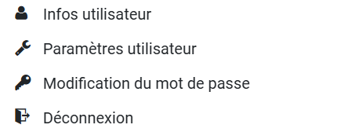

# Espace utilisateur

<figure><figcaption></figcaption></figure>

**Profil utilisateur :**

Accéder aux informations et paramètres utilisateurs.\
Modifier votre mot de passe.

\

<figure><figcaption></figcaption></figure>
