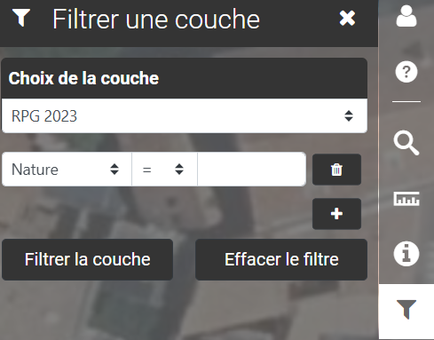

# Filtrer

<figure><figcaption></figcaption></figure>

**Filtrer :**

Filtrer sur la couche de votre choix en choisissant parmi différents opérateurs, si votre couche a été configurée au préalable pour cette option.

\

<figure><figcaption></figcaption></figure>
