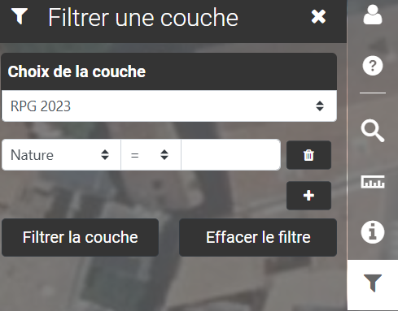
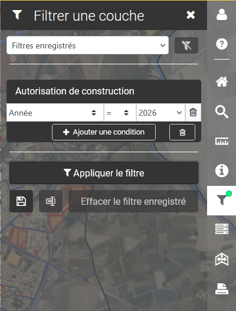

# Filtrer

<figure><figcaption></figcaption></figure>

**Filtrer :**

Filtrer sur la couche de votre choix en choisissant parmi différents opérateurs, si votre couche a été configurée au préalable pour cette option.

<figure><figcaption></figcaption></figure>

🟢 Lorsqu'un filtre est appliqué, un point vert s'affiche sur le symbole de filtre

***

ℹ️ Pour certaines cartes, vous avez la possibilité de sauvegarder vos filtres pour les appliquer plus rapidement (voir ci-dessous)

1. Définir un filtre
2. Cliquer sur la 💾 pour enregistrer le filtre auquel vous devez donner un nom &#x20;
   1. le nom peut être changé en appliquant le filtre et en cliquant sur l'îcone à droite de la disquette
   2. le filtre peut être supprimer en appliquant le filtre et en cliquant sur : "Effacer le filtre enregistré"

<figure><figcaption></figcaption></figure>

