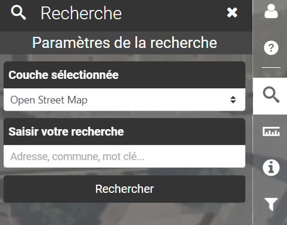

# Recherche

<figure><figcaption></figcaption></figure>

**Recherche :**

Outil de localisation par saisie en fonction d'une base de données sélectionnée.

<figure><figcaption></figcaption></figure>

> OpenStreetMap :  Permet de rechercher des informations France entière, préciser le nom de la commune afin de restreindre la recherche au territoire.\
> ex : Ecole Mario Roustan, Lunel
>
>
>
> Cadastre - Archives :  Permet de rechercher une parcelle par sa section et son numéro dans l'ensemble des archives numériques cadastrales
>
> ex : AV 219 LUNEL
