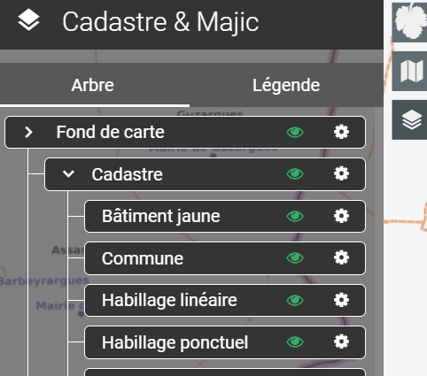

# Gestion de la carte

**Couches :**

Les couches représentent les différents ensembles de données affichées sur une carte.&#x20;

Cette section est divisée en deux onglets : **Arbre** et **Légende :**\

* Arbre : Cet onglet affiche l'ensemble des couches disponibles pour une carte. Elles sont organisées par thématique, offrant une structure claire pour sélectionner et manipuler les données pertinentes.\

* Légende : Cet onglet détaille les légendes des différents objets des couches, fournissant une interprétation visuelle et descriptive des éléments présents sur la carte.

<figure><figcaption></figcaption></figure>
