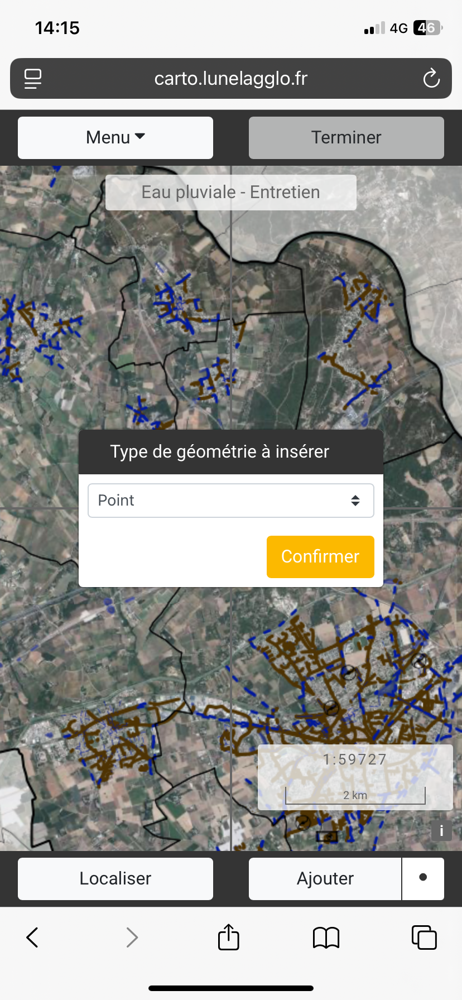
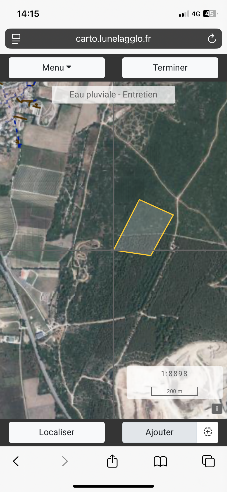
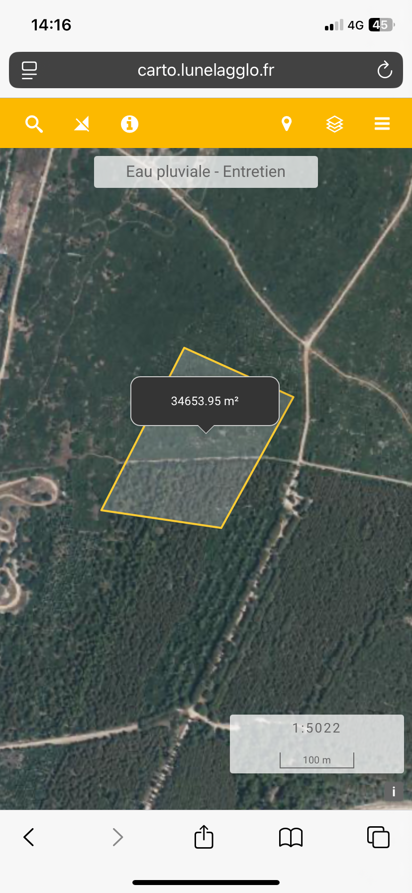

# Mesure

Se rendre dans le **Menu** puis cliquer sur **Mesure**

<figure><figcaption></figcaption></figure> <figure><figcaption></figcaption></figure> <figure><figcaption></figcaption></figure>

