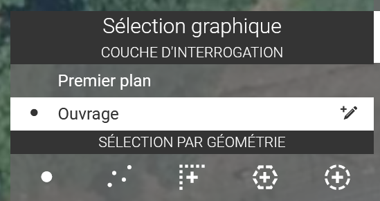
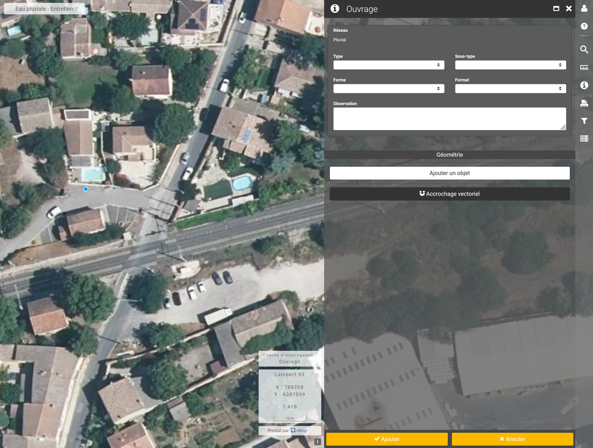
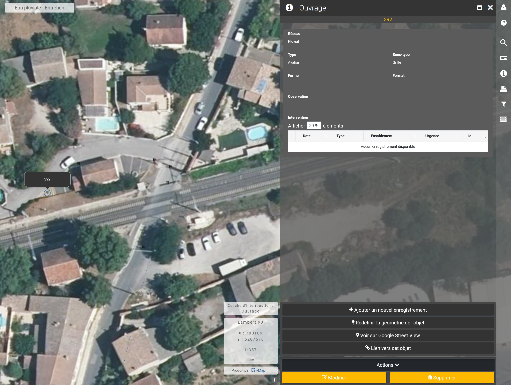

# Insertion/modification/suppression d'une entité

### 1) Insertion

<figure><figcaption></figcaption></figure>

Dans l'outil de sélection, sélectionner la couche sur laquelle on souhaite réaliser de la saisie.&#x20;

Si la saisie est autorisée alors vous verrez le symbole ✏️ apparaitre.

<figure><figcaption></figcaption></figure>

Cliquer dessus ✏️ pour engager la saisie.

<figure><figcaption></figcaption></figure>

Dessiner l'entité à ajouter et renseigner le formulaire de saisie puis faites **Ajouter** pour enregistrer

#### 2) Modification 

Après avoir interrogé une entité, vous pouvez cliquer sur le menu  " : "&#x20;

1. cliquer sur **Modifier** 📝 pour modifier les informations saisies&#x20;
2. **Redéfinir la géométrie 📌**pour modifier ou déplacer la géométrie&#x20;

<figure><figcaption></figcaption></figure>

#### 3) Suppression 

Après avoir sélectionner l'entité à supprimer cliquer sur **Supprimer** 🗑️ en bas à droite

<figure><figcaption></figcaption></figure>

