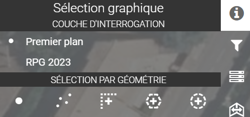

# Sélection graphique

<figure><figcaption></figcaption></figure>

**Interrogation simple**

Après avoir choisi la couche à interroger (couche au premier plan par défaut), un simple clic sur une entité de la carte donne accès à une fenêtre qui permet de visualiser les informations de l'entité en question.

<figure><figcaption></figcaption></figure>

**Sélection graphique - Interrogation multiple**

Réaliser des sélections graphiques sur les cartes et visualiser le résultat des entités sélectionnées dans le requêteur.

\
Choisir une méthode de sélection spatiale :

```
• Point / Multi point.
• Polygone : terminer la saisie à partir d’un double clic.
• Ligne : terminer la saisie à partir d’un double clic.
• Cercle : le premier point localise le centre du cercle et le dernier clic termine la construction de l’objet.
```

<figure><figcaption></figcaption></figure>

