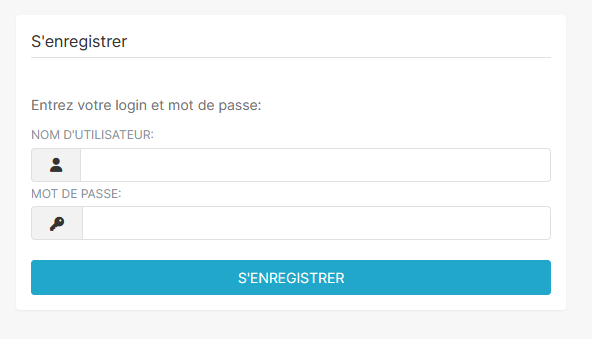

# Observatoire - Superset

## 1- Comment accéder à superset ?

Afin d'utiliser Superset, les utilisateurs doivent suivre une procédure de création de compte et s'assurer d'avoir des identifiants valides

### Création de compte

Pour demander un accès :

* Envoyez un e-mail à l'adresse suivante : [sig@lunelagglo.fr](mailto:sig@lunelagglo.fr)
* Un formulaire de création de compte vous sera transmis par retour de mail.
* Complétez le formulaire avec soin et retournez-le par e-mail à la même adresse.

> ⚠️ Assurez-vous que toutes les informations fournies sont exactes pour éviter tout retard dans le processus.
>
>

### Connexion à Superset

Une fois votre compte créé :

* Copiez-collez l'URL suivante dans votre navigateur : [https://observatoire.lunelagglo.fr/](https://observatoire.lunelagglo.fr/)
* Entrez votre identifiant et mot de passe. Veillez à respecter les majuscules et minuscules.

> ⚠️ L'application nécessite impérativement un compte utilisateur. Il n'y a pas d'accès public à Superset.

<figure><figcaption></figcaption></figure>

