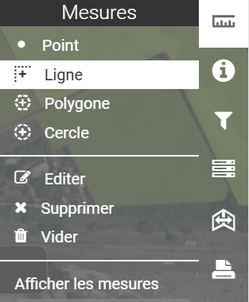

# Outils de mesure

<figure><figcaption></figcaption></figure>

**Outils de mesure :**

Options permettant le calcul de longueurs, superficies et mesures de géométries.\
Il faut sélectionner l'outil par exemple "ligne" puis cliquer sur la carte au niveau des points de la polygone qu'on souhaite mesurer.\
Une infobulle affiche alors avec la longueur au fur et à mesure.\
Pour terminer la mesure, il faut double-cliquer sur la carte au moment du dernier point.

\

<figure><figcaption></figcaption></figure>

