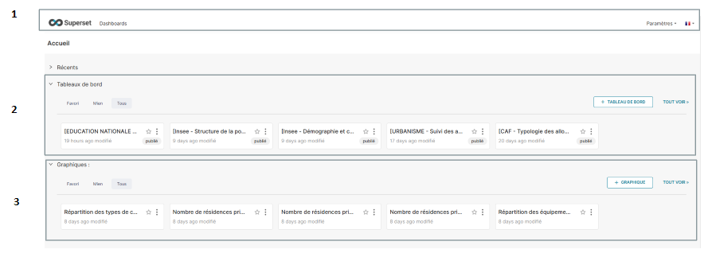

# Interface de Superset

<figure><figcaption></figcaption></figure>

Une fois connecté à Superset, l'utilisateur est accueilli par une interface claire et fonctionnelle :

### 1) Barre de navigation

* **Bouton "Dashboards" :** Placé à côté du logo, il redirige directement vers la liste des tableaux de bord disponibles.
* **Paramètres :** Situé à droite, ce bouton donne accès aux options de configuration utilisateur ou aux paramètres avancés de l'application.
* **Langue :** Juste à côté des paramètres, cet élément permet de sélectionner la langue d'affichage de l'interface en fonction des préférences de l'utilisateur.

### 2) Tableaux de bord récents

Une section affichant les tableaux de bord récemment consultés ou modifiés pour un accès rapide.

### 3) Graphiques récents

Cette section affiche les graphiques récemment modifiés ou ajoutés par les administrateurs. Les utilisateurs peuvent les consulter pour visualiser les dernières mises à jour et analyses préparées.

##
