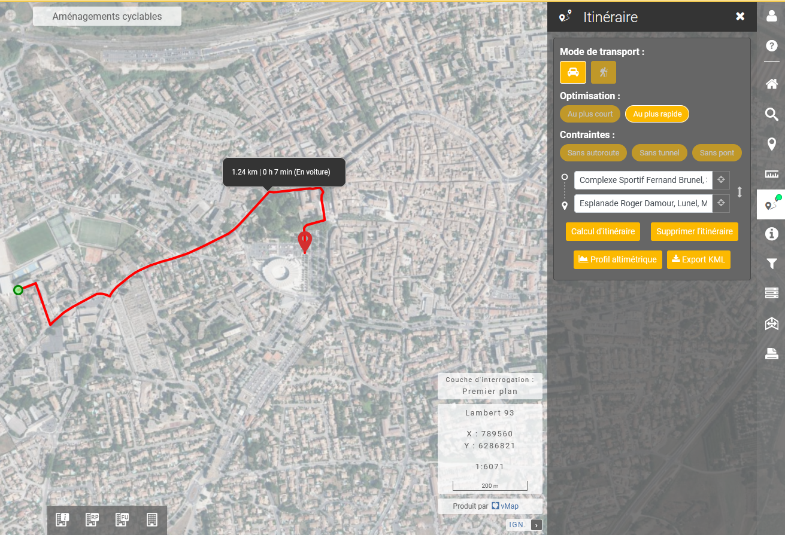
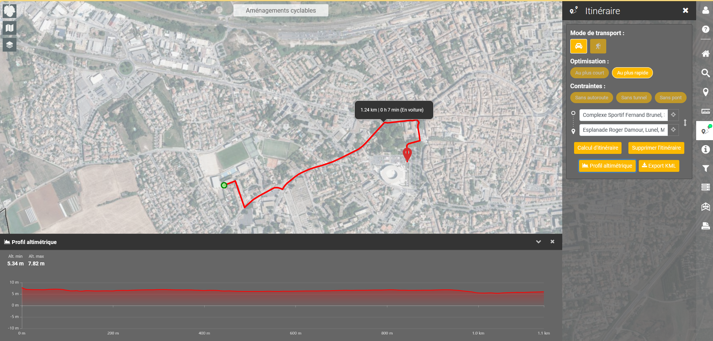

# Itinéraire

Permet de calculer un itinéraire (voiture/piéton) entre deux points.

1. Cliquer sur le bouton itinéraire
2. Positionner le point de départ sur la carte&#x20;
3. Positionner le point d'arrivée sur la carte&#x20;

L'itinéraire est calculé automatiquement mais il est possible de modifier le mode de transport, d'optimiser et de contraindre le calcul.

<figure><figcaption></figcaption></figure>

Il est possible d'afficher le profil altimétrique en cliquant sur le bouton dédié.

<figure><figcaption></figcaption></figure>
