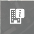
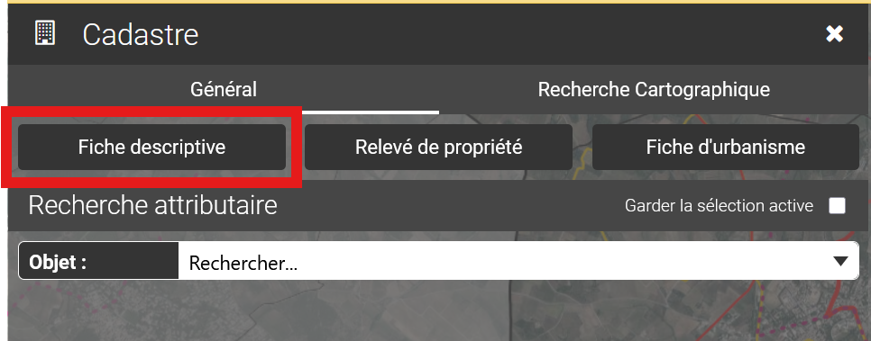
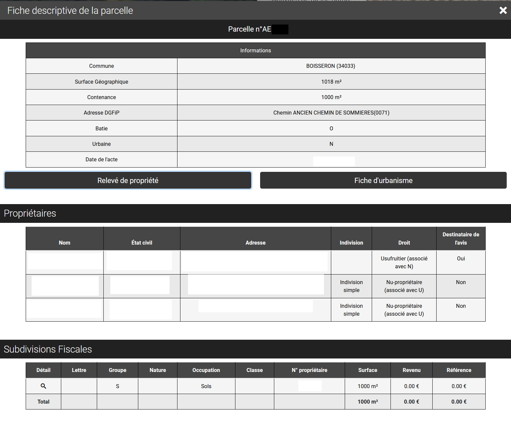

# Fiche descriptive

Cliquer sur le bouton Fiche descriptive (i), puis sélectionner sur la carte, la parcelle dont on souhaite extraire les informations cadastrales.

<figure><figcaption></figcaption></figure>

ou via le module cadastre complet :

<figure><figcaption></figcaption></figure>

Les éléments constitutifs de la fiche descriptive d'une parcelle sont préalablement configurés par l'administrateur de l”application vMap.

La fiche descriptive fournit généralement les éléments suivants :

* le numéro, la superficie et la commune d”appartenance de la parcelle
* la liste des propriétaires de la parcelle
* la liste des subdivisions fiscales de la parcelle
* la liste des bâtis de la parcelle

***

La fiche descriptive de la parcelle retourne sous forme tabulaire la liste des propriétaires et des subdivisions fiscales de la parcelle sélectionnée. Elle est relative à une unique parcelle.

<figure><figcaption></figcaption></figure>

