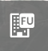
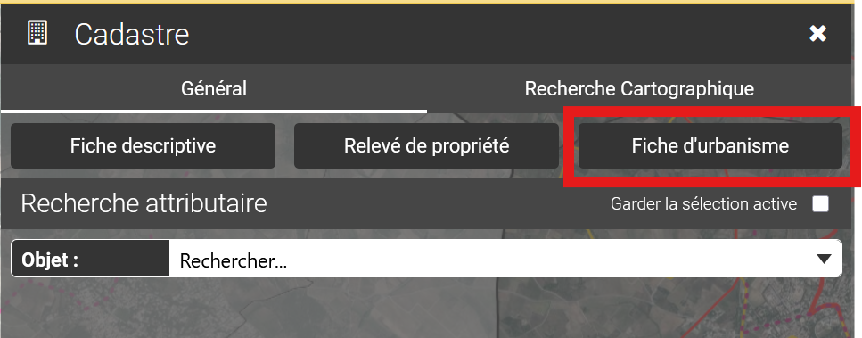

# Fiche d'urbanisme

Cliquer sur le bouton Fiche d'urbanisme, puis cliquer sur la parcelle dont on souhaite extraire la fiche.

<figure><figcaption></figcaption></figure>

ou via le module cadastre complet :

<figure><figcaption></figcaption></figure>

Les éléments constitutifs de la fiche d”urbanisme sont préalablement configurés par l”administrateur de l”application vMap.&#x20;

Une fiche d”urbanisme est généralement constituée des éléments suivants :

* Titre et en-tête
* Carte illustrant la parcelle sélectionnée dans sa commune d”appartenance
* Descriptif de la parcelle (numéro de section, numéro de parcelle….)
* Liste des propriétaires de la parcelles
* …
