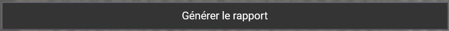
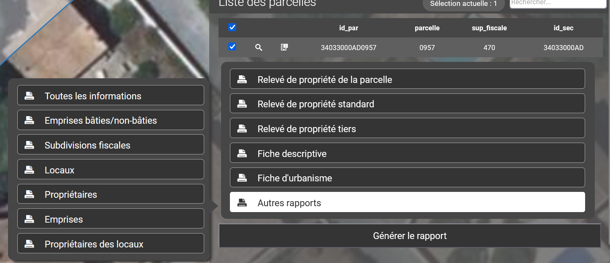

# Générer un rapport

La dernière étape du processus d”interrogation des données cadastrales consiste à générer un rapport du ou des objets sélectionnés et ajoutés au panier.

Une fois un élément sélectionné puis ajouté au panier, il est possible de générer un rapport en cliquant sur le bouton :

<figure><figcaption></figcaption></figure>

En cliquant sur celui-ci, une liste d'exports possible est proposée :

<figure><figcaption></figcaption></figure>

Plusieurs rapports relatifs aux parcelles sont livrés avec l'application vMap :

* [Relevé de propriété de la parcelle](releve-de-propriete.md)
* [Relevé de propriété standard](releve-de-propriete.md)
* [Relevé de propriété tiers](releve-de-propriete.md)
* [Fiche descriptive de la parcelle](fiche-descriptive.md)
* [Fiche d'urbanisme](fiche-durbanisme.md)
*   Autres rapports

    * Toutes les informations

    Un rapport des parcelles sélectionnées est généré au format PDF. Il contient pour chaque parcelle l”intégralité des composants cadastraux : références de parcelle, propriétaires, subdivisons fiscales, emprise bâti/non bâti et locaux.

    * Emprise bâties/non bâties
    * Subdivisions fiscales
    * Locaux
    * Propriétaires
    * Propriétaires des locaux

⚠️ Certains rapports sont relatifs à une et une seule parcelle, alors que d”autres sont relatifs à plusieurs parcelles sélectionnées et ajoutées au panier.
