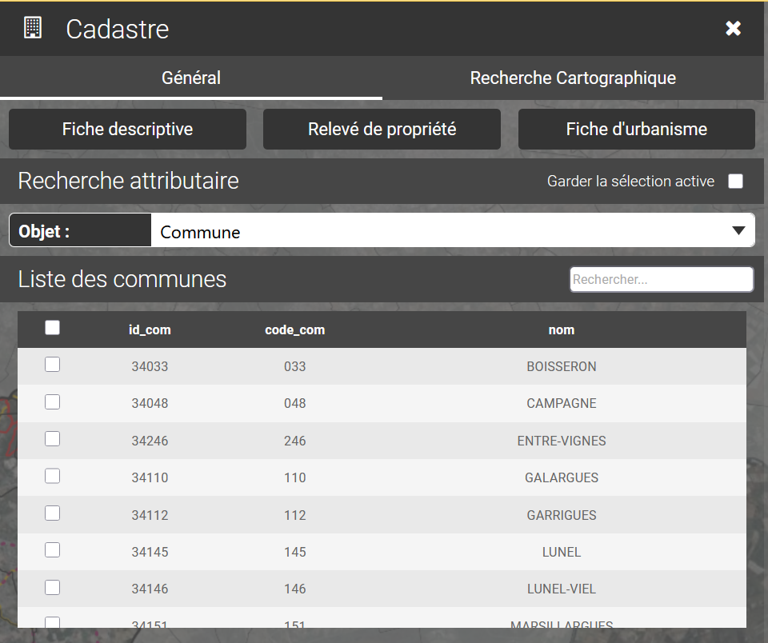
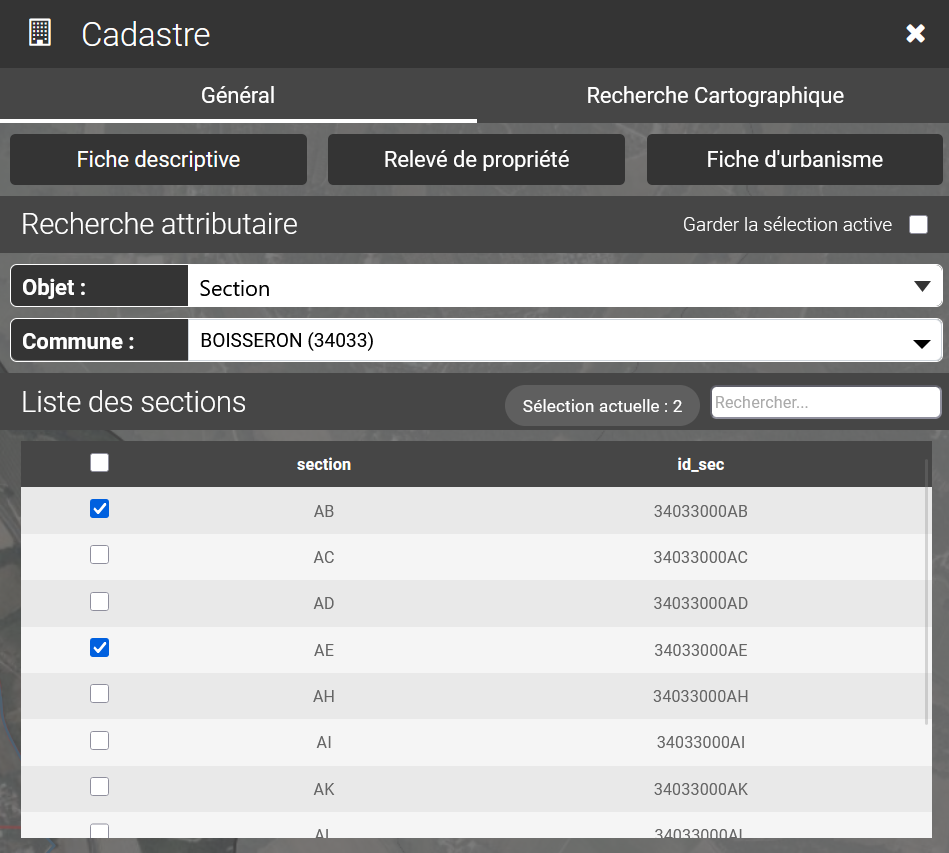
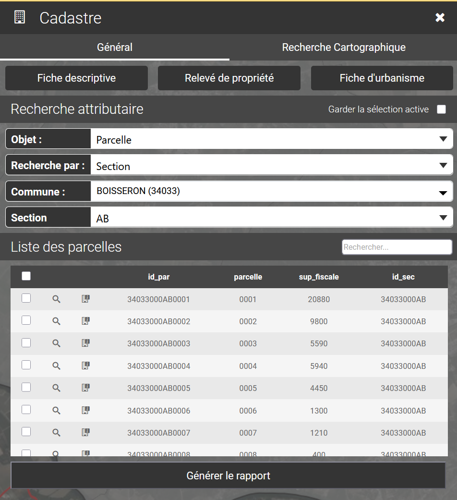
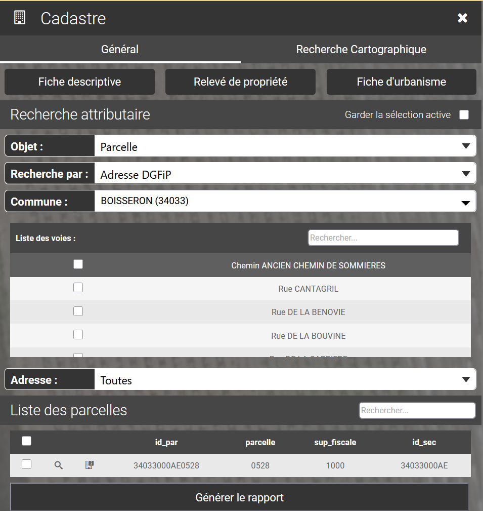
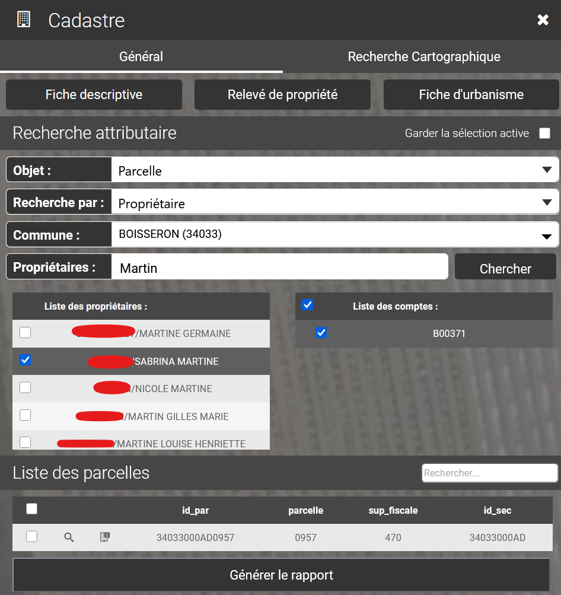

# Recherche attributaire

La recherche des objets du cadastre peut être effectuée à partir des données littérales sans passer par la carte et la sélection graphique. L'onglet Recherche attributaire permet ce mode de recherche.&#x20;

5 types de recherche sont disponible :

* La recherche de commune
* La recherche de section(s)
* la recherche de lieu(x) dit(s)
* la recherche de parcelle(s)
* la recherche de bâti(s)

A chaque objet sélectionné, correspondent des critères de recherche différents.

***

### La recherche de commune

Après avoir indiqué la commune comme objet recherché, l'opérateur sélectionne dans la liste déroulante, la commune dont il veut extraire les données attributaires.

<figure><figcaption></figcaption></figure>

***

### La recherche de section(s)

Après avoir indiqué la section comme objet recherché, l'opérateur sélectionne dans la liste déroulante, la commune de la section recherchée. Les sections s”affichent sous forme tabulaire. L”opérateur sélectionne la ou les sections dont il veut extraire les informations. La case à cocher ✔️ permet de sélectionner une ou plusieurs sections du tableau.

ℹ️ Un formulaire permet la saisie d'une section pour en filtrer la liste.

<figure><figcaption></figcaption></figure>

***

### La recherche de lieu(x) dit(s)

Après avoir indiqué le lieu dit comme objet recherché, l'opérateur sélectionne dans la liste déroulante la commune du lieu dit. Les lieux dits s'affichent sous forme de liste. L”opérateur sélectionne le ou les lieux dits dont il veut extraire les informations. La case à cocher ✔️ permet de sélectionner un ou plusieurs lieux dits. \
\
ℹ️ Un formulaire permet la saisie du nom ou d'une partie du nom d'un lieu dit pour en filtrer la liste.

***

### La recherche de parcelle(s)

Après avoir indiqué la parcelle comme objet recherché, l'opérateur sélectionne dans la liste déroulante le critère de recherche désiré :

* recherche de parcelle(s) par section
* recherche de parcelle(s) par adresse DGFIP
* recherche de parcelle(s) par propriétaire

#### **La recherche de parcelles par section**

L'opérateur sélectionne la commune puis la section d”appartenance de la parcelle. La liste des parcelles s'affichent sous forme tabulaire. L'opérateur sélectionne la ou les parcelles dont il veut extraire les informations. La case à cocher ✔️ permet de sélectionner une ou plusieurs parcelles.

ℹ️ Un formulaire permet la saisie de la référence ou d'une partie de la référence de la parcelle pour en filtrer la liste.

<figure><figcaption></figcaption></figure>

#### **La recherche par adresse DGFIP**

L'opérateur sélectionne la commune puis la voie d'appartenance de la parcelle.&#x20;

ℹ️ Un formulaire permet la saisie du nom ou d'une partie du nom de la voie pour en filtrer la liste. Idem pour les parcelles de la voie

📋La liste « Adresse » permet ensuite de sélectionner une ou toutes les adresses de la voie sélectionnée.

La liste des parcelles s'affichent ensuite sous forme tabulaire. L'opérateur sélectionne la ou les parcelles dont il veut extraire les informations.&#x20;

<figure><figcaption></figcaption></figure>

#### **La recherche par propriétaire**

L'opérateur sélectionne la commune puis le propriétaire de la parcelle. Un module de recherche permet de filtrer la lister des propriétaires en saisissant le nom ou une partie du nom du propriétaire.

⚠️ Il faut saisir un minimum de 3 caractères pour que le module de recherche puisse fonctionner.

⚠️ La recherche se fait à la fois sur le nom et le prénom du propriétaire.

<figure><figcaption></figcaption></figure>

La liste des propriétaires de la commune s”affiche. L'opérateur sélectionne ensuite le ou les comptes du propriétaire sélectionné. La case à cocher ✔️ permet de sélectionner toutes les comptes.&#x20;

Il sélectionne ensuite la ou les parcelle (s) dont il cherche à extraire les informations. La case à cocher ✔️ permet ensuite de sélectionner une ou plusieurs parcelles.&#x20;

ℹ️ Un formulaire permet la saisie de la référence ou d'une partie de la référence de la parcelle pour en filtrer la liste.

📰 Une fois sélectionnée(s), la(es) parcelles(s) peut(vent) être utilisée pour générer un rapport.

***

#### **La recherche par bâti**

L'opérateur sélectionne la commune puis le propriétaire de la parcelle. Un module de recherche permet de filtrer la liste des propriétaires en saisissant le nom ou une partie du nom du propriétaire.

⚠️ Il faut saisir un minimum de 3 caractères pour que le module de recherche puisse fonctionner.

⚠️ La recherche se fait à la fois sur le nom et le prénom du propriétaire.

La liste des propriétaires de la commune s'affiche. L'opérateur sélectionne ensuite le ou les comptes du propriétaire sélectionné. La case à cocher ✔️ permet de sélectionnes un ou plusieurs comptes.&#x20;

L'opérateur sélectionne ensuite dans la liste le bâti associés au(x) compte(s) sélectionné(s). Il sélectionne ensuite le ou les invariant (s) (numéro unique attribué à chaque logement), puis la ou les parcelle (s) dont il cherche à extraire les informations. La case à cocher ✔️ permet ensuite de sélectionner une ou plusieurs parcelles.&#x20;

ℹ️ Un formulaire permet la saisie de la référence ou d'une partie de la référence de la parcelle pour en filtrer la liste.

📰 Une fois sélectionnée(s), la(es) parcelles(s) peut(vent) être utilisée pour générer un rapport.

