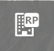
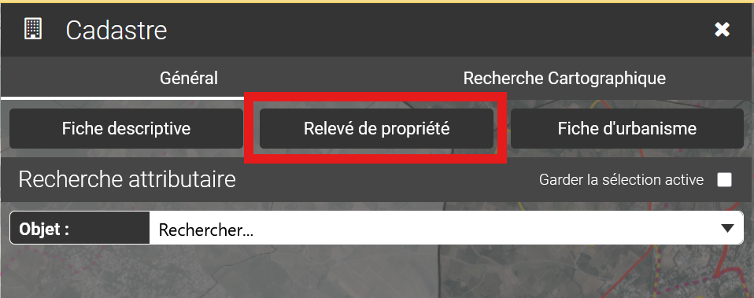

# Relevé de propriété

Cliquer sur le bouton Relevé de propriété, puis sélectionner la parcelle à interroger par un clic sur la carte.

<figure><figcaption></figcaption></figure>

ou via le module cadastre complet :

<figure><figcaption></figcaption></figure>

4 types de relevés sont disponibles :

* Relevé de propriété standard : génération au format pdf, du relevé de propriété (Il est relatif à une compte.).
* Relevé de propriété tiers : génération au format pdf du relevé de propriété tiers  (Il est relatif à une compte.).

> _Le contenu est le même que le relevé de propriété standard sans les informations de naissance du propriétaire_

* Relevé de propriété de la parcelle : génération au format pdf du relevé de propriété de la parcelle sélectionnée (Il est relatif à une unique parcelle.).
* Relevé de propriété de la parcelle tiers : génération au format pdf du relevé de propriété de la parcelle tiers sélectionnée (Il est relatif à une unique parcelle.).

> _Le contenu est le même que le relevé de propriété de la parcelle sans les informations de naissance du propriétaire_
