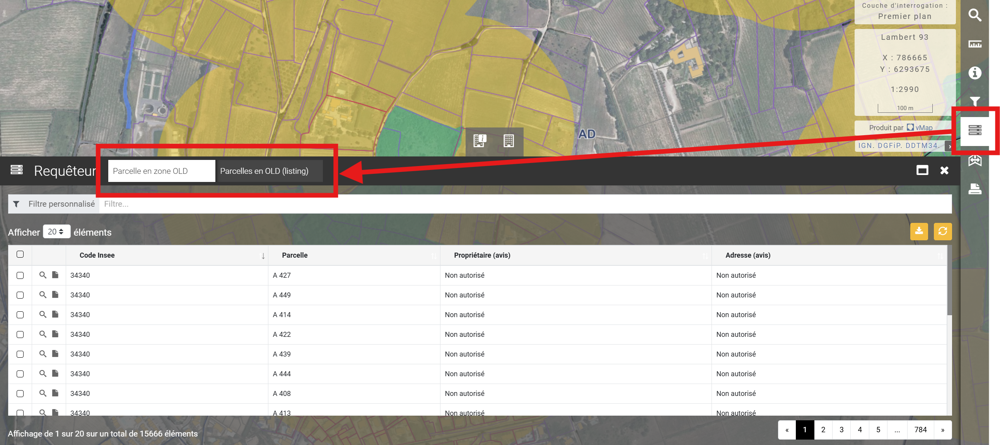

# Télécharger le listing des propriétaires de parcelles en zone OLD

Se rendre dans la carte **"Obligations Légales de Débroussaillement"**

1. Cliquer sur le bouton du **Requêteur**
2. Sélectionner l'onglet :&#x20;
   1. **"Parcelle en zone OLD"** pour extraire un fichier ou chaque parcelle est individualisée par section, numéro et propriétaire
   2. **"Parcelles en OLD (listing)"** pour obtenir une version agrégée par propriétaire
3. Télécharger le fichier ⬇️

<figure><figcaption></figcaption></figure>

