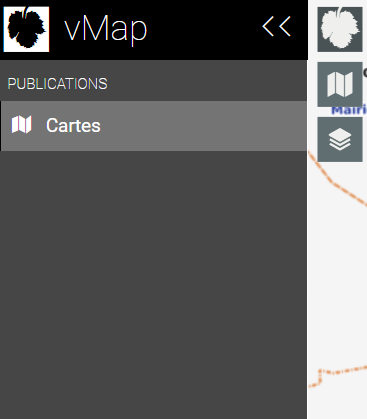
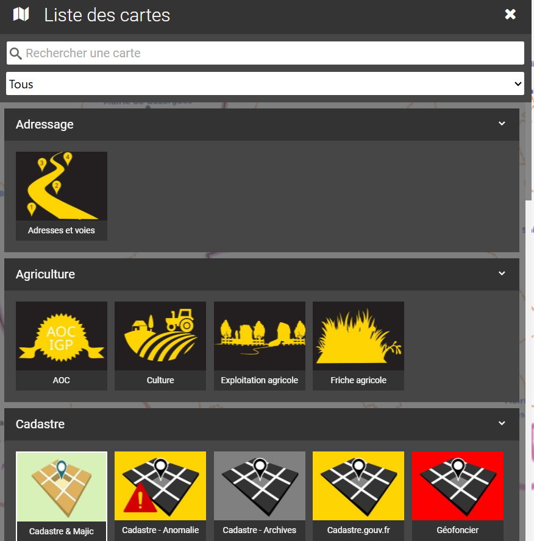

# Carthothèque

### 1) Accès à l'ensemble des cartes :

<figure><figcaption></figcaption></figure>

**Menu :**

<figure><figcaption></figcaption></figure>

Le menu est l'élément principal de navigation. Il permet d'accéder rapidement aux fonctionnalités et options essentielles de l'application.

<figure><figcaption></figcaption></figure>

**Cartes :**

Cette section donne accès à l'ensemble des cartes disponibles. Elle permet de visualiser et de gérer les différentes cartes créées ou partagées avec l'utilisateur. Une zone de recherche rapide par thématique est également disponible, permettant de cibler directement la carte recherchée pour une navigation encore plus efficace.

<figure><figcaption></figcaption></figure>
