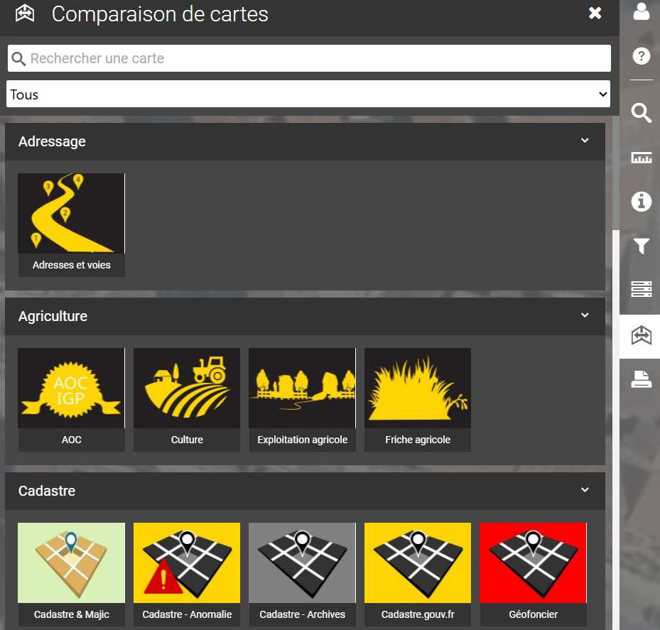

# Comparaison de cartes

<figure><figcaption></figcaption></figure>

**Comparer :**

Choisir une nouvelle carte pour la comparer à la carte active.\
Cet outil permet de comparer 2 cartes qui n'auraient pas les mêmes informations pour une même position et une même échelle.

<figure><figcaption></figcaption></figure>
