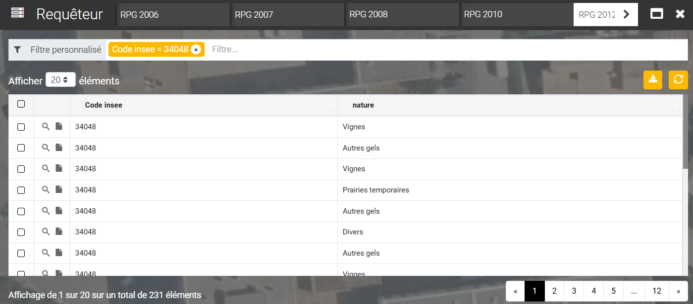

# Requêteur

<figure><figcaption></figcaption></figure>

**Outils requêteur :**

Option ouvrant le formulaire de requête de la table cible. Cet outil permet de consulter l’ensemble de la table d’une couche cible telle qu’elle est organisé dans la base de données.\
Pour chercher directement l’information voulue, la ligne « Filtre personnalisé » est là pour aider à réduire le nombre d’entités selon un ou plusieurs facteurs souhaités.

<figure><figcaption></figcaption></figure>
