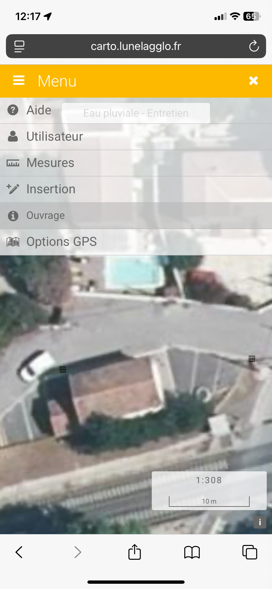
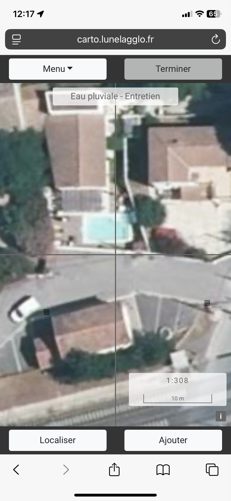
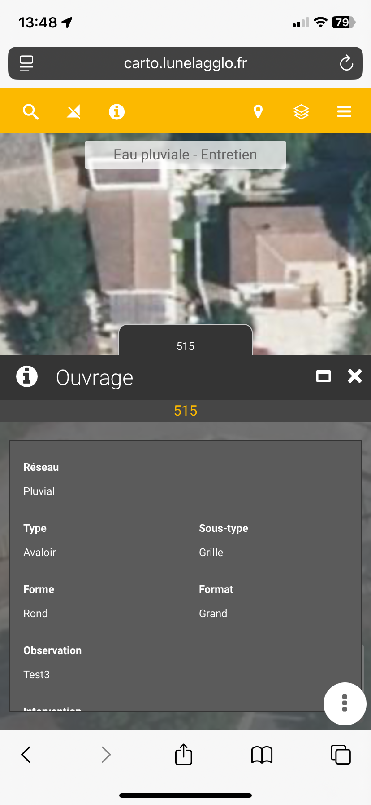
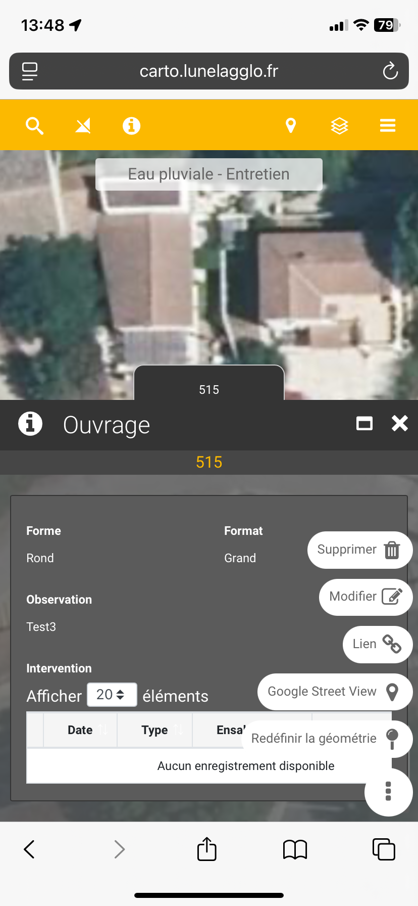
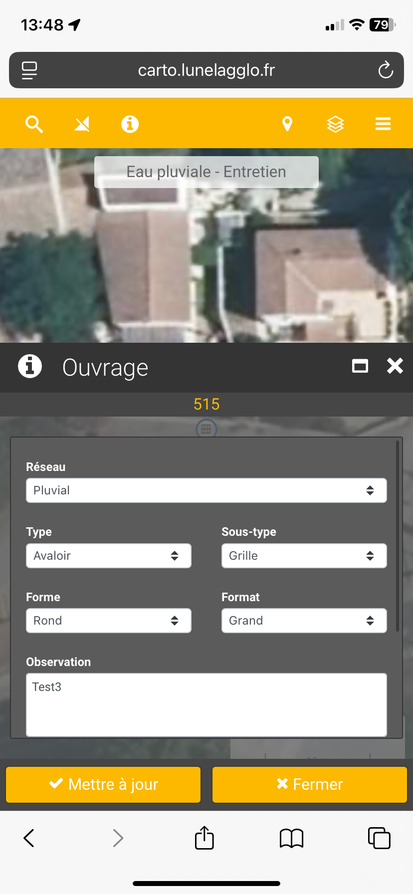

# Insertion/modification/suppression d'une entité

### 1) Insertion

vMap2 permet de saisir des données depuis un téléphone mobile. Pour ce faire il faut se rendre dans "Menu" / "Insertion" / "Nom de la couche de saisie"

<figure><figcaption></figcaption></figure> <figure><figcaption></figcaption></figure>

Ensuite, vous pouvez :&#x20;

1. placer le centre de la croix à l'endroit ou vous souhaitez réaliser la saisie
2. Cliquer sur ajouter pour saisir le point
3. Cliquer sur terminer pour enregistrer votre dessin&#x20;
4. A l'issue le formulaire va s'ouvrir vous permettant de renseigner les différentes informations relatives à l'entité saisie.

<figure><figcaption></figcaption></figure> <figure><figcaption></figcaption></figure>

### 2) Interrogation

Dans le menu du haut cliquer sur ℹ️ pour éventuellement choisir la couche que vous souhaitez interroger en cliquant sur un objet

<figure><figcaption></figcaption></figure> <figure><figcaption></figcaption></figure>

### 3) Modification

Après avoir interrogé une entité, vous pouvez cliquer sur le menu  " : "&#x20;

1. cliquer sur **Modifier** 📝 pour modifier les informations saisies&#x20;

<figure><figcaption></figcaption></figure> <figure><figcaption></figcaption></figure>

2. **Redéfinir la géométrie 📌**pour modifier ou déplacer la géométrie&#x20;

### 4) Suppression

Après avoir interrogé une entité, vous pouvez cliquer sur le menu  " : " et cliquer sur supprimer 🗑️

<figure><figcaption></figcaption></figure>

