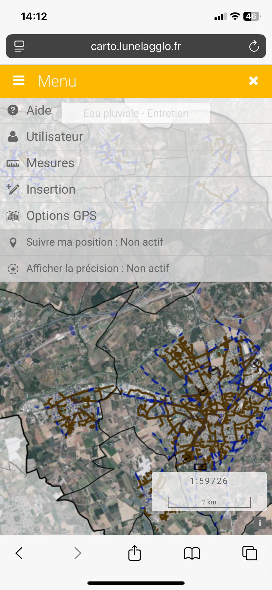

# Option GPS

Se rendre dans le **Menu** puis cliquer sur **Option GPS**.&#x20;

Cela vous permettra :&#x20;

1. Définir le suivi de votre position : Si vous vous déplacez la carte vous suivra
2. Afficher la précision : Permet de visualiser un cercle autour de la position GPS représentant la précision du positionnement

<figure><figcaption></figcaption></figure>
