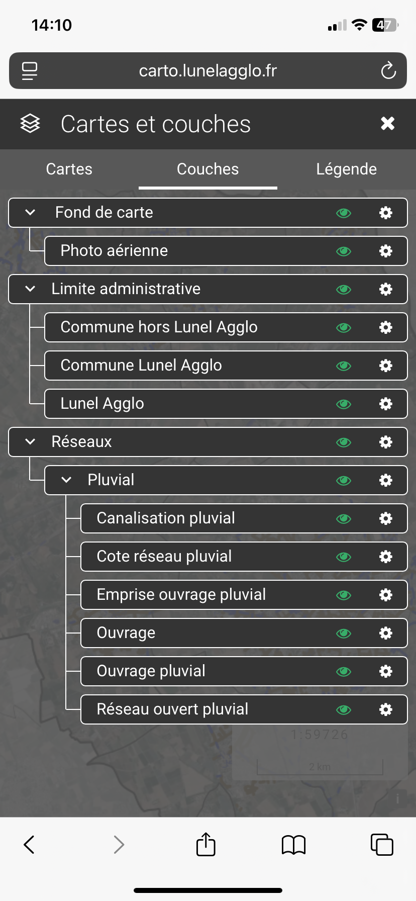
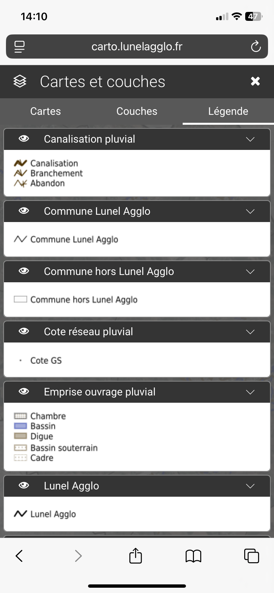

# Gestion de la carte

En cliquant sur **Couches** vous pouvez visualiser la liste des couches de la carte et choisir d'activer ou non la couche 👁️ ou de jouer sur la transparence en cliquant sur le symbole ⚙️.

<figure><figcaption></figcaption></figure>

En cliquant sur **Légende** vous pouvez visualiser la réprésentation de chacunes des couches actives.

<figure><figcaption></figcaption></figure>
